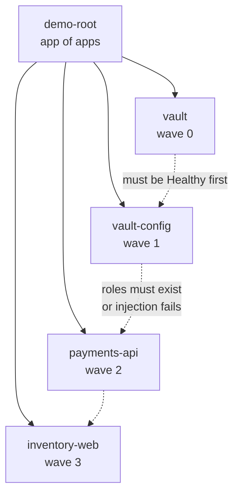

# OpenShift GitOps + Kustomize + Vault — a quick demo

A small, self-contained demo repo that shows seven things working together on
OpenShift:

| # | Thing | Where to look |
|---|-------|---------------|
| 1 | **App of apps** | [bootstrap/root-application.yaml](bootstrap/root-application.yaml) → [apps/](apps/) |
| 2 | **Sync waves**, between apps and inside apps | `argocd.argoproj.io/sync-wave` everywhere |
| 3 | **Two example applications** | [manifests/payments-api/](manifests/payments-api/), [manifests/inventory-web/](manifests/inventory-web/) |
| 4 | **key=value properties** as the config source format | `manifests/*/base/config/*.properties` |
| 5 | **Kustomize generates the ConfigMaps and Secrets** | `configMapGenerator` / `secretGenerator` in each `kustomization.yaml` |
| 6 | **Vault agent injection** for real credentials | `vault.hashicorp.com/*` annotations on both Deployments |
| 7 | **Red Hat's GitOps recommended practices**, applied and audited | [Recommended practices](#recommended-practices) |

The interesting contrast is 5 vs 6: kustomize-generated Secrets are only
base64, so they are plaintext in git and fine for bootstrap values. The actual
database password never appears in this repo — it reaches the pod at runtime
through the Vault agent sidecar.

---

## Repo layout

```
bootstrap/                    applied once, by hand
├── appproject-platform.yaml  cluster-config project (may create cluster-scoped objects)
├── appproject-apps.yaml      application project (deliberately cannot)
└── root-application.yaml     the app-of-apps root

platform/                     Argo CD instance settings - applied by hand, NOT synced
├── argocd-openshift-gitops-patch.yaml   annotation tracking, resource exclusions
└── appproject-global.yaml    optional global AppProject for inherited settings

apps/                         nothing but Application CRs - the root app syncs this
├── vault.yaml                wave 0   project: demo-platform
├── vault-config.yaml         wave 1   project: demo-platform
├── payments-api.yaml         wave 2   project: demo-apps
└── inventory-web.yaml        wave 3   project: demo-apps

manifests/                    the actual workloads
├── vault/                    dev-mode Vault + agent injector webhook
├── vault-config/             Job that seeds Vault (auth method, KV, policies, roles)
├── payments-api/
│   ├── base/
│   │   ├── config/*.properties     <- key=value source of truth
│   │   └── kustomization.yaml      <- configMapGenerator + secretGenerator
│   └── overlays/demo/              <- overrides individual keys, pins the image digest
└── inventory-web/
    ├── base/
    └── overlays/demo/

scripts/
├── set-repo.sh               point the Applications at your fork
├── validate.sh               render + kubeconform + policy checks
└── verify.sh                 post-sync checks, incl. reading injected secrets

.github/workflows/
└── validate.yaml             runs scripts/validate.sh on every PR
```

The split into **two AppProjects** is the security shape worth copying:
`demo-platform` may create `ClusterRoleBinding` and `MutatingWebhookConfiguration`
because Vault needs them; `demo-apps` explicitly cannot, so an application team
cannot grant itself cluster-wide permissions through GitOps.

---

## Prerequisites

- An OpenShift 4.12+ cluster, cluster-admin.
- The **Red Hat OpenShift GitOps** operator installed, with the default
  `openshift-gitops` Argo CD instance running.
- A git repo the cluster can reach (a public fork is easiest).
- Cluster nodes able to pull `docker.io/hashicorp/*` and
  `registry.access.redhat.com/ubi9/python-311`. If Docker Hub rate limits bite,
  mirror the two Vault images and change the `images:` block in
  [manifests/vault/kustomization.yaml](manifests/vault/kustomization.yaml)
  (both the tag and the digest).
- Optional, for the full local check: `kubeconform` on `$PATH`. Without it
  `scripts/validate.sh` still renders and runs its policy checks, and CI runs
  the schema stage regardless.

Install the operator if needed:

```bash
oc apply -f - <<'EOF'
apiVersion: operators.coreos.com/v1alpha1
kind: Subscription
metadata:
  name: openshift-gitops-operator
  namespace: openshift-operators
spec:
  channel: latest
  name: openshift-gitops-operator
  source: redhat-operators
  sourceNamespace: openshift-marketplace
  installPlanApproval: Automatic
EOF

oc rollout status deploy/openshift-gitops-server -n openshift-gitops --timeout=5m
```

---

## Quickstart

```bash
# 1. Configure the Argo CD instance itself (annotation tracking, resource
#    exclusions). Applied by hand, before anything else - see below for why.
oc patch argocd openshift-gitops -n openshift-gitops \
  --type=merge --patch-file platform/argocd-openshift-gitops-patch.yaml
oc rollout status deploy/openshift-gitops-repo-server -n openshift-gitops --timeout=5m

# 2. Fork/push this repo somewhere the cluster can reach, then point at it.
#    Pass a git tag rather than a branch for anything you care about.
./scripts/set-repo.sh https://github.com/YOU/argocd-quick-demo.git main

# 3. Sanity check locally - CI runs exactly this
./scripts/validate.sh

# 4. Commit and push. Argo CD reads git, not your working copy.
git add -A && git commit -m "point at my fork" && git push

# 5. Apply the two AppProjects and the app-of-apps root. Only manual apply.
kustomize build bootstrap | oc apply -f -

# 6. Watch it unfold
watch oc get applications -n openshift-gitops

# 7. Check the result
./scripts/verify.sh
```

Step 1 is separate on purpose. An Argo CD instance that syncs its own
configuration can lock itself out: a bad sync takes down the controller that
would have reconciled the fix. In a real setup that config lives in a
cluster-configuration repo driven by a *different* Argo CD instance.

Argo CD console URL:

```bash
oc get route openshift-gitops-server -n openshift-gitops -o jsonpath='https://{.spec.host}{"\n"}'
```

---

## What actually happens, in order



Argo CD will not start a wave until every resource in the previous wave is
both **synced and healthy**. That ordering is the whole reason the demo works
unattended: if `payments-api` came up before the `vault-config` Job had created
the `payments-api` Vault role, the agent init container would fail its login
and the pod would hang in `Init:0/1`.

**Between Applications** (annotation on each Application in [apps/](apps/)):

| Wave | Application | Why here |
|------|-------------|----------|
| 0 | `vault` | Nothing can get secrets until Vault and the injector webhook exist |
| 1 | `vault-config` | Needs a running Vault to write auth config, policies and roles into |
| 2 | `payments-api` | Needs its Vault role to exist |
| 3 | `inventory-web` | Same, and staged one wave later purely so the rollout is visible in the UI |

**Inside each Application** (annotation on individual resources):

| Wave | `vault` | `payments-api` / `inventory-web` |
|------|---------|----------------------------------|
| -1 | `Namespace` | — (Argo CD creates it, see below) |
| 0 | `ServiceAccount`, `ClusterRole`, `ClusterRoleBinding` | `ServiceAccount` |
| 1 | Vault `Deployment` + `Service` | Generated `ConfigMap`s and `Secret`s |
| 2 | Injector `Deployment` + `Service` | `Deployment` |
| 3 | `MutatingWebhookConfiguration` | `Service`, `Route` |

The two application namespaces are **not** Namespace manifests in the repo.
They are created by Argo CD via `CreateNamespace=true`, with their labels and
annotations supplied by `managedNamespaceMetadata`:

```yaml
syncPolicy:
  syncOptions:
    - CreateNamespace=true
  managedNamespaceMetadata:
    labels:
      demo.redhat.com/vault-injection: enabled
```

That label is what the Vault injector's webhook `namespaceSelector` matches on,
so an application opts into injection without the platform layer knowing its
name. It also keeps `Namespace` — a cluster-scoped kind — out of the
application manifests, which is what lets `demo-apps` stay locked down.

Generated resources get their wave through the per-generator `options:` block,
since there is no YAML file to annotate:

```yaml
configMapGenerator:
  - name: payments-api-env
    envs:
      - config/application.properties
    options:
      annotations:
        argocd.argoproj.io/sync-wave: "1"
```

---

## The four ways config reaches a pod

Both apps deliberately use a different mix, and their web pages print all of
it so you can show it on screen.

| Mechanism | Source | Lands as | Used by |
|---|---|---|---|
| `configMapGenerator` + `envs:` | `config/application.properties` | env vars via `envFrom` | both apps |
| `configMapGenerator` + `files:` | `config/logging.properties`, `config/ui.properties` | a mounted file | both apps |
| `secretGenerator` + `envs:` | `config/bootstrap-secret.env` | env vars via `envFrom` | payments-api |
| `secretGenerator` + `files:` | `config/session.properties` | a mounted file | inventory-web |
| **Vault agent injection** | `secret/data/<app>/…` in Vault | a rendered file in `/vault/secrets/` | both apps |

Every one of those sources is the same `key=value` properties format. That is
the point: one format, and the choice of `envs:` vs `files:` decides whether
the app sees environment variables or a real properties file.

### Overlays override keys, not files

`overlays/demo` never copies `application.properties`. It merges a handful of
literals over the base generator:

```yaml
configMapGenerator:
  - name: payments-api-env
    behavior: merge
    literals:
      - APP_ENV=demo
      - LOG_LEVEL=debug
      - PAYMENTS_MAX_AMOUNT=25000
```

`inventory-web` also demonstrates `behavior: replace`, which discards the base
file entirely — use it when an environment needs a genuinely different file
rather than a few different keys.

### The content hash is the feature

Generated names carry a hash of their content:

```
payments-api-env-t795598k5b
payments-api-props-gd6fcc9779
payments-api-bootstrap-6dgfcd2hdh
```

Kustomize rewrites every reference (`envFrom`, `volumes`) to the hashed name.
Change one line in a `.properties` file and the name changes, the Deployment's
pod spec changes, and the rollout happens on its own. Hand-written ConfigMaps
do not do this — you edit them and the pods keep running the old values.

Try it:

```bash
sed -i 's/LOG_LEVEL=debug/LOG_LEVEL=trace/' \
  manifests/payments-api/overlays/demo/kustomization.yaml
git commit -am "bump log level" && git push
# Argo CD goes OutOfSync, syncs a new ConfigMap name, and rolls the Deployment.
```

---

## Vault injection

The demo runs Vault in **dev mode** — in-memory, auto-unsealed, root token
`root`, plain HTTP. It is wiped on every pod restart. That is a deliberate
trade to keep the demo to a single `oc apply`; see
[Not production](#not-production) below.

[manifests/vault-config/scripts/seed-vault.sh](manifests/vault-config/scripts/seed-vault.sh)
runs as an Argo CD `Sync` hook and sets up, per app: a KV entry, a read-only
policy scoped to that app's path, and a Kubernetes auth role bound to exactly
one ServiceAccount in one namespace.

The app side is annotations only — no Vault client library, no token handling,
no Kubernetes Secret:

```yaml
vault.hashicorp.com/agent-inject: "true"
vault.hashicorp.com/role: "payments-api"
vault.hashicorp.com/agent-set-security-context: "false"
vault.hashicorp.com/agent-inject-secret-database.properties: "secret/data/payments-api/database"
vault.hashicorp.com/agent-inject-template-database.properties: |
  {{- with secret "secret/data/payments-api/database" -}}
  db.username={{ .Data.data.username }}
  db.password={{ .Data.data.password }}
  db.url={{ .Data.data.url }}
  {{- end }}
```

The webhook rewrites the pod to add a `vault-agent-init` container (fetches
secrets before the app starts) and a `vault-agent` sidecar (re-renders them
when they change), sharing an in-memory volume mounted at `/vault/secrets`.

Three things are easy to get wrong:

- **`agent-set-security-context: "false"` is required on OpenShift.** By
  default the agent pins itself to UID 100, which `restricted-v2` rejects and
  the pod never starts. Setting it false lets OpenShift assign a UID from the
  namespace range.
- **The ServiceAccount name is load-bearing.** The Vault role is bound to
  `bound_service_account_names=payments-api` in
  `bound_service_account_namespaces=payments-demo`. Rename the SA and login
  fails with `permission denied`.
- **The injector patches its own webhook CA bundle at runtime.** The `vault`
  Application therefore carries an `ignoreDifferences` entry for
  `/webhooks/0/clientConfig/caBundle`, otherwise `selfHeal` would keep wiping
  the CA and the webhook would break every few minutes.

`inventory-web` shows a template that ranges over the whole KV entry, so
adding a field in Vault adds a property in the pod with no manifest change:

```
{{- range $k, $v := .Data.data }}
{{ $k }}={{ $v }}
{{- end }}
```

### Live rotation demo

`inventory-web` sets a 30s render interval, so this is visible while you talk:

```bash
POD=$(oc get pod -n vault-demo -l app.kubernetes.io/name=vault -o name | head -1)
oc exec -n vault-demo "$POD" -- sh -c \
  'VAULT_ADDR=http://127.0.0.1:8200 VAULT_TOKEN=root \
   vault kv put secret/inventory-web/api \
     api_key=rotated-key-1234 \
     api_endpoint=https://inventory.example.com/api/v3 \
     webhook_signing_key=rotated-signing-key'

APP=$(oc get pod -n inventory-demo -l app.kubernetes.io/name=inventory-web -o name | head -1)
oc exec -n inventory-demo "$APP" -c app -- cat /vault/secrets/api.properties
# wait ~30s, run again - the file changed, the pod never restarted
```

---

## Suggested demo script

1. **Show the tree.** Apply `bootstrap/`, then the Argo CD UI: one root app
   fans out to four, and they turn green left to right. That is app-of-apps
   plus sync waves in one picture.
2. **Show a properties file.** `manifests/payments-api/base/config/application.properties`
   — plain `key=value`, no YAML.
3. **Show the generated result.** `oc get cm -n payments-demo` — note the hash
   suffix, and that no ConfigMap YAML exists anywhere in the repo.
4. **Show the overlay.** Four literals override four keys; the base file is
   untouched and reusable.
5. **Open the app Routes.** Both pages print their ConfigMap env vars, their
   mounted files, and their Vault-injected secret.
6. **Show the injected pod.** `oc get pod -n payments-demo -o yaml` — the
   `vault-agent-init` container and `vault-agent` sidecar are not in this repo;
   the webhook added them.
7. **Change a property, push, watch it roll.** Content hash → new name → new
   pod spec → automatic rollout.
8. **Rotate a Vault secret.** File updates in place, no restart.
9. **Show the guardrail.** Add a `ClusterRoleBinding` to
   `manifests/payments-api/base/`, push, and watch the sync be *rejected* —
   `demo-apps` forbids cluster-scoped RBAC. `./scripts/validate.sh` catches the
   same thing before the commit even lands.

---

## What CI checks

[scripts/validate.sh](scripts/validate.sh) is the "validate manifests via
linting" practice made concrete. It runs on every PR and fails on:

- any kustomization that does not render;
- schema violations (`kubeconform -strict`, with Argo CD CRD schemas — this is
  what caught `managedNamespaceMetadata` being one level too high while this
  repo was being written);
- a container image that is not digest-pinned, in any directory an Application
  actually deploys;
- an Application on the `default` AppProject, tracking `HEAD`, or missing
  `manifest-generate-paths`;
- an AppProject with no tenant `roles:` or a `'*'` cluster allow-list;
- **a rendered resource whose kind its own AppProject forbids** — the
  `not permitted in project` sync failure, caught at PR time.

It warns, without failing, when `targetRevision` is a branch.

```
==> policy checks
  ok    images digest-pinned
  ok    5 Applications: non-default project, generate-paths present
  ok    5 Applications render only kinds their AppProject permits
  ok    AppProjects: tenant roles present, no wildcard cluster allow-list
```

---

## Troubleshooting

| Symptom | Cause |
|---|---|
| App stuck `Init:0/1`, init container logs show `permission denied` | The Vault role does not match the SA/namespace, or the `vault-config` Job did not finish. Check `oc logs -n vault-demo -l app.kubernetes.io/name=vault-seed`. |
| Pod starts but `/vault/secrets/` is empty | Injector never fired. Check the webhook's `namespaceSelector` includes your namespace, and that `vault-agent-injector` is running. |
| Init container `CreateContainerConfigError` about UID | `agent-set-security-context: "false"` is missing. |
| `vault` app flaps OutOfSync forever | The `ignoreDifferences` entry for `caBundle` was removed. |
| Everything gone after a Vault pod restart | Expected — dev mode is in-memory. Re-sync `vault-config` to reseed. |
| `vault-seed` Job fails with "field is immutable" | It lost its `argocd.argoproj.io/hook: Sync` annotation. |
| Sync fails: "resource ... is not permitted in project demo-apps" | Working as designed. The app tried to create a kind the restricted project forbids — move it to `manifests/vault/` (project `demo-platform`) or add the kind to `namespaceResourceWhitelist` if it genuinely belongs to the app. |
| Pods start but never get a Vault sidecar, and the namespace looks fine | The `demo.redhat.com/vault-injection: enabled` label is missing from the namespace. It comes from `managedNamespaceMetadata`; check `oc get ns payments-demo --show-labels`. |
| Argo CD reports drift on resources it does not own | Label tracking. Apply the instance patch to switch to annotation tracking. |

Useful:

```bash
oc get applications -n openshift-gitops -o wide
oc describe application payments-api -n openshift-gitops
oc logs -n payments-demo <pod> -c vault-agent-init
oc logs -n vault-demo deploy/vault-agent-injector
oc get ns payments-demo --show-labels          # managedNamespaceMetadata applied?
oc get appproject demo-apps -n openshift-gitops -o yaml
```

---

## Recommended practices

Checked against Red Hat's
[OpenShift GitOps recommended practices](https://developers.redhat.com/blog/2025/03/05/openshift-gitops-recommended-practices).
Each row says where the practice lives, or why it does not apply here.

### Recommended

| Practice | Status | Where |
|---|---|---|
| Source code and manifests in different repos | ✅ | This repo is manifests only. The two apps run a stock `ubi9/python-311` image; the only "code" is a shell snippet in the Deployment that renders a status page, which exists so the demo has something to show. |
| Use a YAML management tool | ✅ | Kustomize throughout. Zero hand-written ConfigMap or Secret YAML. |
| Version manifests | ✅ | Every image is digest-pinned via the kustomize `images:` transformer. `targetRevision` is set by `set-repo.sh`, which warns when you pass a branch; `validate.sh` fails on `HEAD` and warns on `main`/`master`. |
| Validate manifests via linting | ✅ | [scripts/validate.sh](scripts/validate.sh): render → `kubeconform` (with CRD schemas) → repo-specific policy checks. Wired to PRs in [.github/workflows/validate.yaml](.github/workflows/validate.yaml). |
| Use annotation tracking | ✅ | `resourceTrackingMethod: annotation` in [platform/argocd-openshift-gitops-patch.yaml](platform/argocd-openshift-gitops-patch.yaml). |
| Do not use the Default AppProject | ✅ | Two custom projects: [demo-platform](bootstrap/appproject-platform.yaml), [demo-apps](bootstrap/appproject-apps.yaml). `validate.sh` fails any Application on `default`. |
| Define tenant RBAC in the AppProject | ✅ | `roles:` on both projects, not in the global `argocd-rbac-cm`. |

### Suggested

| Practice | Status | Where |
|---|---|---|
| Global AppProject for common settings | ⚙️ Optional | [platform/appproject-global.yaml](platform/appproject-global.yaml) plus the `globalProjects` block in the instance patch. Both tenant projects carry the matching label, so it is inert until you enable it. |
| Custom health checks for custom resources | ➖ N/A | The demo deploys no custom resources whose health Argo CD cannot already determine. Add a `resource.customizations.health.<group>_<kind>` Lua script if you introduce one. |
| Separate instances for cluster config vs applications | ⚠️ Partial | Everything runs on the single `openshift-gitops` instance so the demo is one `oc apply`. The *separation of concerns* is real though — platform and application concerns are split across two AppProjects with different privileges, and `platform/` is deliberately outside the app-of-apps. Splitting into two instances is the next step; see below. |
| Minimize application-controller privileges | ⚠️ Partial | Enforced at the project layer: `demo-apps` blacklists `ClusterRole`, `ClusterRoleBinding`, `Role`, `RoleBinding` and both webhook kinds, and whitelists only the six namespaced kinds the apps actually use. The controller's own ServiceAccount still holds the operator's default cluster-admin. |
| Apps-in-any-namespace | ➖ N/A | Two applications on one instance. Worth it past ~50 namespaces; needs `sourceNamespaces` on the AppProject and a matching `.spec.sourceNamespaces` on the ArgoCD CR. |

### Situational

| Practice | Status | Where |
|---|---|---|
| Resource inclusion/exclusion | ✅ | `resourceExclusions` in the instance patch, plus `resource.respectRBAC: normal` so the list does not have to be exhaustive. Tune the list for your cluster. |
| Persist health status in Redis | ➖ N/A | Default from Argo CD 3.0 / OpenShift GitOps 1.15. It is an `argocd-cmd-params-cm` setting the operator reconciles, not an ArgoCD CR field — noted at the bottom of the instance patch. |
| Monorepo scaling | ✅ | Every Application carries `argocd.argoproj.io/manifest-generate-paths`, so a commit touching `manifests/payments-api/` does not invalidate the repo-server cache for the other three. `validate.sh` fails if one is missing. |

### To take this to production

The two structural gaps, in order:

1. **Split the Argo CD instances.** Keep `openshift-gitops` for cluster
   configuration (it would own `manifests/vault/` and `platform/`), and create
   a second ArgoCD CR in its own namespace for application teams, with a
   ServiceAccount that has no cluster-scoped write permissions at all. The
   AppProject split here maps onto that boundary directly.
2. **Replace the dev Vault.** See [Not production](#not-production).

Then pin `targetRevision` to a tag, and promote between environments by
moving the tag rather than by merging to a branch.

---

## Not production

Called out explicitly so nobody copies the wrong parts:

- **Vault is in dev mode.** In-memory storage, auto-unseal, root token `root`,
  HTTP not TLS. Real deployments use the Vault Helm chart or Vault Enterprise
  with Raft/Consul storage, real unseal keys, and TLS.
- **Vault is seeded from git.** [config/seed.env](manifests/vault-config/config/seed.env)
  contains the demo credentials in plaintext so the demo is reproducible. In
  reality Vault is seeded out-of-band and that file does not exist.
- **`secretGenerator` is base64, not encryption.** Anything in a
  `*-secret.env` file is readable by anyone with repo access. Keep it to
  low-sensitivity bootstrap values, or add SOPS / Sealed Secrets / External
  Secrets Operator.
- **One Argo CD instance runs both cluster config and applications.** The
  AppProjects enforce the split, but a real platform separates the instances
  too. See [Recommended practices](#recommended-practices).
- **`automated: {prune: true, selfHeal: true}` on everything.** Convenient for
  a demo; think carefully before enabling it on stateful workloads, and note
  that `prune: true` will delete resources the moment they leave git.
- **Image digests are pinned to what was current when this was written.**
  Pinning is the practice; staying current is a separate job. Re-resolve with
  `skopeo inspect --no-tags docker://<image>:<tag> | jq -r .Digest` and update
  the `images:` blocks. Vault 2.x exists; this demo stays on the 1.x line
  because dev-mode and CLI behaviour there is what the seed script assumes.
